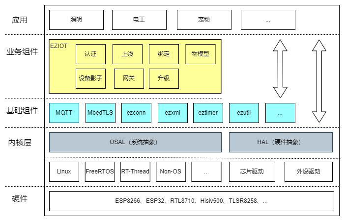

# Ezviz IoT OS

## 简介

Ezviz IoT OS（简称EZOS）是萤石云IoT开放平台面向物联网领域的嵌入式开发框架，主要采用C语言编写，不依赖于具体设备平台和操作系统，具有非常好的可移植性，新的MCU仅需适配C运行时、TCP/IP 协议栈以及必要的系统依赖接口即可完成接入。

受到成本和体积等因素的影响，物联网芯片无法像通用操作系统（Windows/Linux）那样集成所有的驱动，对Flash和RAM内存资源的使用往往需要精打细算。为了提高代码复用率，提升可维护性，降低模块的耦合度，EZOS采用基于组件的开发模型(Component-Based Development) ，可裁剪性非常好，对于资源受限的MCU，可通过图形化的工具配置出合适的SDK。

## 架构

EZOS 主要由以下部分组成：

- 内核层：EZOS不依赖于具体的操作系统和硬件，内核层主要做OS抽象及硬件抽象，为上层组件和应用屏蔽硬件的差异性。
- 基础组件：由工具类、通用协议类或三方开源库组成。这类代码功能高度内聚、可复用性强，采用组件化设计，可降低组件之间耦合度。
- 业务组件：封装萤石IoT的业务封装，包括设备认证、物模型、OTA等
- 应用：针对某个行业的具体应用，开发者可以基于萤石IoT沉淀的成熟品类（如照明）进行低代码开发，也可以在[萤石IoT产品控制台](https://iot.eziot.com/home/product)上自定义品类进行开发。

## 代码导读

[工程目录及模块说明](./docs/ezos_code_guide.md)

通过此文档可以了解Ezviz IoT OS的目录结构、模块信息等。

# 快速入门

[快速入门指南](./docs/ezos_get_started.md)

该文档基于esp8266和Ubuntu，介绍如何快速完成编译、烧录及运行。

# 开发

## 构建系统

[构建系统指南](./docs/ezos_build_system.md)

该文档介绍了Ezviz IoT OS的编译构建框架。

## 移植指南

[移植指南](./docs/ezos_porting_guide.md)

该文档基于esp8266芯片平台，详细介绍如何快速移植。

## 组件开发指南

[组件开发指南](./docs/ezos_component_develop.md)

该文档介绍了Ezviz IoT OS组件的构成以及完整的开发流程。

## 应用开发指南

[应用开发指南](./docs/ezos_app_develop.md)

该文档基于应用模板，详细介绍了如何使用Ezviz IoT OS组件进行开发，以及如何结合芯片厂家SDK一起完成链接的方法。

# 代码贡献

[代码规范 & 源码贡献指南](./docs/ezos_contribute_guide.md)

该文档包含Ezviz IoT OS的编程规范、文档写作规范、提交代码&文档时信息的填写规范、以及如何提交到Ezviz IoT OS仓库。

# 相关链接

- [萤石IoT开放平台官网](https://www.eziot.com)
- [萤石IoT产品控制台](https://iot.eziot.com/home/product)
