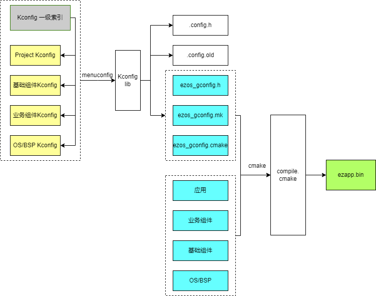
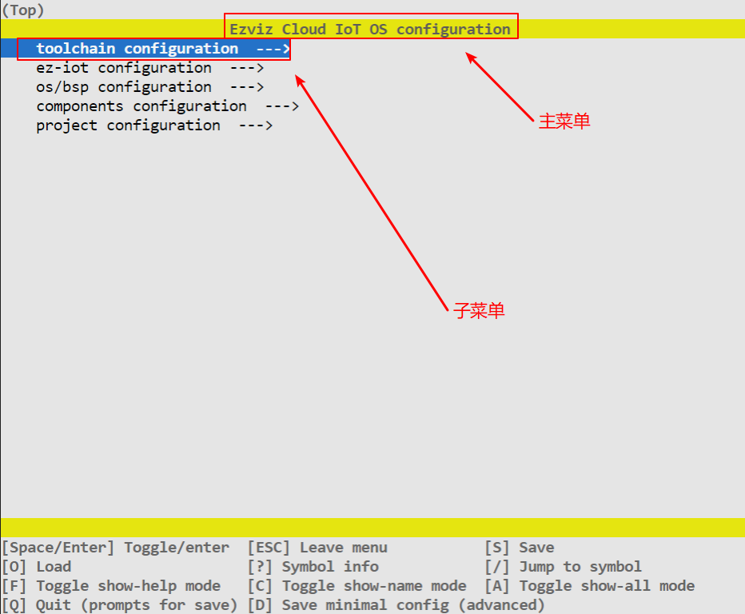
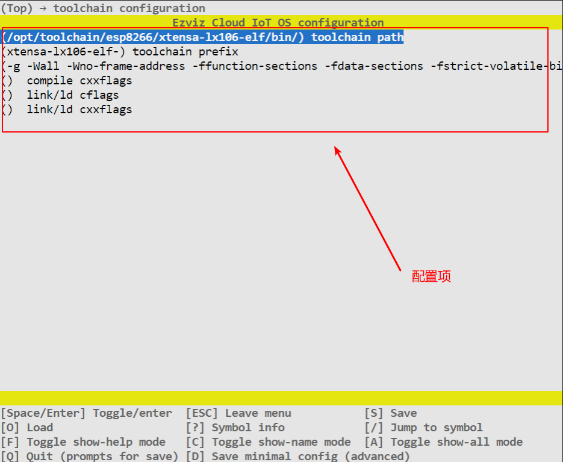
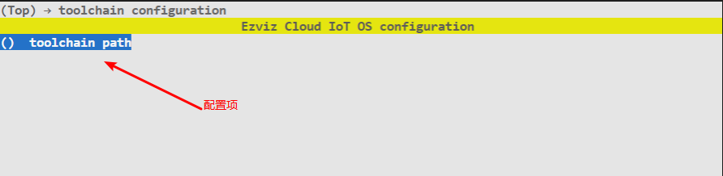

# 构建系统

本文档着重于阐述Ezviz IoT OS构建系统的原理，通过此文档您可以了解到组件的概念，以及如何将众多组件组织起来生成一份"定制版SDK"。

## 适用范围

- 希望深入学习CMake + Kconfig + Python构建系统组织方法
- 遇到编译构建问题需解决
- 想通过升级改造满足更多使用场景


如果您只需要做移植和应用开发，可以参考[快速入门指南](./ezos_get_started.md)、[移植指南](./docs/ezos_porting_guide.md)、[应用开发指南](./docs/ezos_app_develop.md)等文档。

## 简介

构建工具是一种软件，基本功能是可以根据一定的规则，将源代码构建成可执行的二进制程序。对于嵌入式开发，比较常见的构建是GNU Make和CMake，可通过Makefile/CMakeList.txt 文件来检测组织结构和依赖关系，最终完成构建和链接。

在 V2.0.0 版本之前，Ezviz IoT OS使用的是CMake构建工具，遇到以下问题：

- 无法灵活性配置。同一款芯片，不同业务场景，CMake无法灵活裁剪功能和优化资源。
- 可维护性不足。因根据项目灵活配置，需要改动构建脚本、源码、甚至目录，导致针对不同应用的SDK较难合并。


从 V2.0.0 版本开始，Ezviz IoT OS引入了 CMake + Python + Kconfig 构建系统，将代码粒度拆分到组件级别，每个组件的功能明确且可配置。软件开发者可以将更多精力花在功能开发上，只要遵循固定开发范式，组件就可以被上层应用配置和使用。

## 目录结构

```shell
ez-iot-os
|   apps
|   +-- ezapp_project
|       +-- inc
|       +-- src
|       |   +-- port
|       |       +-- esp8266
|       |           +-- main
|       |           |   +-- main.c
|       |           |   +-- CMakeLists.txt // 应用组件构建
|       |           +-- CMakeLists.txt     // 调用compile.cmake的构建入口
|       |
|       +-- Kconfig
|
+-- components
|   +-- component1
|   |   +-- inc
|   |   +-- src
|   |   +-- CMakeLists.txt
|   |   +-- Kconfig
|   |
|   +-- component2
|       +-- inc
|       +-- src
|       +-- CMakeLists.txt
|       +-- Kconfig
|
+-- eziot
|   +-- component3
|       +-- sub_component1
|       |   +-- inc
|       |   +-- src
|       |   +-- CMakeLists.txt
|       |   +-- Kconfig
|       |
|       +-- sub_component2
|       |   +-- inc
|       |   +-- src
|       |   +-- CMakeLists.txt
|       |   +-- Kconfig
|       |
|       +-- CMakeLists.txt
|       +-- Kconfig
|
+-- platform
|   +-- inc
|   +-- bsp
|       +-- esp8266
|           +-- ezos
|               +-- *.c
|               +-- CMakeLists.txt
|               +-- Kconfig
|
+-- tools
|   +-- cmake
|       +-- compile.cmake // 构建组织方法
|   +-- kconfig
|       +-- Kconfiglib    // menuconfig GUI渲染、生成.config
|       +-- genconfig.py  // 根据.config生成ezos_gconfig.mk、ezos_gconfig.cmake、ezos_gconfig.h
|
+-- Kconfig // 一级索引
```

## 组织方法



**构建入口**

EZOS的构建入口方法在"${EZOS_PATH}/tools/cmake/compile.cmake"脚本文件中，由上层应用发起调用。


**设置EZOS_PATH**

设置EZOS_PATH的方法有三种，分别为：

- 设置全局环境变量：（略）
- 设置临时环境变量：
```shell
export EZOS_PATH=~/ez_iot_os
```
- 设置相对路径临时变量：

```cmake
if(NOT EZOS_PATH)
    get_filename_component(EZOS_PATH ../../../../ ABSOLUTE)
endif()
```


**调用构建入口**

在项目工程的CMakeList.txt中调用compile.cmake的方法触发构建流程。触发构建的方法有两种，分别为:

- 仅构建库。(这种方法适用于用EZOS的组件，但需要由其他三方脚本完成链接)：

```cmake
do_lib_building()
```

- 构建库+链接。由EZOS完成构建和链接整个过程：

```cmake
do_project_building("ezapp")
```


### Kconfig 组织

构建入口方法被调用时会注册"**静默生成配置**"和"**GUI生成配置**"两条shell命令，前者在make构建时自动更新config文件(没有则按默认生成)，后者需要用户显示调用menuconfig命令，然后通过GUI窗口手动进行配置。


**静默生成配置:**

```cmake
set(generate_config_cmd ${python}  ${EZOS_PATH}/tools/kconfig/genconfig.py
                    --kconfig "${EZOS_PATH}/Kconfig"
                    ${kconfig_defaults_files_args}
                    --menuconfig False
                    --env "EZOS_PATH=${EZOS_PATH}"
                    --env "PROJECT_KCONFIG_PATH=${PROJECT_KCONFIG_PATH}"
                    --env "PROJECT_PATH=${PROJECT_SOURCE_DIR}"
                    --env "PROJECT_NAME=${PROJECT_NAME}"
                    --output config ${PROJECT_PATH}/config/.config
                    --output makefile ${PROJECT_PATH}/config/ezos_gconfig.mk
                    --output cmake  ${PROJECT_PATH}/config/ezos_gconfig.cmake
                    --output header ${PROJECT_PATH}/config/ezos_gconfig.h
                    )
```


**GUI生成配置:**

```cmake
set(generate_config_cmd_gui ${python}  ${EZOS_PATH}/tools/kconfig/genconfig.py
                    --kconfig "${EZOS_PATH}/Kconfig"
                    ${kconfig_defaults_files_args}
                    --menuconfig True
                    --env "EZOS_PATH=${EZOS_PATH}"
                    --env "PROJECT_KCONFIG_PATH=${PROJECT_KCONFIG_PATH}"
                    --env "PROJECT_PATH=${PROJECT_SOURCE_DIR}"
                    --env "PROJECT_NAME=${PROJECT_NAME}"
                    --output config ${PROJECT_PATH}/config/.config
                    --output makefile ${PROJECT_PATH}/config/ezos_gconfig.mk
                    --output cmake  ${PROJECT_PATH}/config/ezos_gconfig.cmake
                    --output header ${PROJECT_PATH}/config/ezos_gconfig.h
                    )
```


**注册shell命令:**

```cmake
add_custom_target(menuconfig COMMAND ${generate_config_cmd_gui})
```


**索引路径:**

kconfig的索引文件来源于两处，一是根目录下的Kconfig一级索引，二是项目工程下的Kconfig。前者用于配置EZOS组件层和OS层，后者用于配置应用层。

```cmake
--kconfig "${EZOS_PATH}/Kconfig"
--env "PROJECT_KCONFIG_PATH=${PROJECT_KCONFIG_PATH}"
```


**嵌套使用:**

kconfig的根目录为一级索引，默认会遍历到所有组件。如组件内部需要划分多个代码模块，且需要独立配置，可在组件的Kconfig建议二级索引，如"${EZOS_PATH}/eziot/ez_iot_bm/Kconfig":

```cmake
osource "${EZOS_PATH}/eziot/ez_iot_bm/*/Kconfig"
```


### CMake 组织

构建入口方法被调用时同时会触发组件的遍历，compile.cmake会在多个预设的目录下遍历组件，以下为基础组件的遍历:

```cmake
# Find components in SDK's components folder, register components
file(GLOB component_dirs ${EZOS_PATH}/components/*)
foreach(component_dir ${component_dirs})
    is_path_component(is_component ${component_dir})
    if(is_component)
        message(STATUS "Find component: ${component_dir}")
        get_filename_component(base_dir ${component_dir} NAME)
        list(APPEND components_dirs ${component_dir})
        if(EXISTS ${component_dir}/Kconfig)
            message(STATUS "Find component Kconfig of ${base_dir}")
            list(APPEND components_kconfig_files ${component_dir}/Kconfig)
        endif()
        if(EXISTS ${component_dir}/.config_defaults)
            message(STATUS "Find component defaults config of ${base_dir}")
            list(APPEND kconfig_defaults_files_args --defaults "${component_dir}/.config_defaults")
        endif()
    endif()
endforeach()
```


### 依赖排序

根据项目下的priority.conf文件**(可选)**和所有组件的依赖关系进行梳理和排序，排序结果会影响编译顺序以及链接顺序。

```cmake
# Sort component according to priority.conf config file
set(component_priority_conf_file "${PROJECT_PATH}/compile/priority.conf")
set(sort_components ${python}  ${EZOS_PATH}/tools/cmake/sort_components.py
                                ${component_priority_conf_file} ${components_dirs}
                    )
execute_process(COMMAND ${sort_components} OUTPUT_VARIABLE component_dirs_sorted RESULT_VARIABLE cmd_res)
```


### 注册组件

依次遍历排序后的组件，进行调用，如果对应组件创建了和目录同名的构建目录，则认为已注册成功，否则视为未注册。

```cmake
# Call CMakeLists.txt
foreach(component_dir ${component_dirs_sorted})
    get_filename_component(base_dir ${component_dir} NAME)
    add_subdirectory(${component_dir} ${base_dir})
    if(TARGET ${base_dir})
        add_dependencies(${base_dir} update_build_info) # add build info dependence
        message(STATUS "component ${base_dir}, ${update_build_info}")

    else()
        message(STATUS "component ${base_dir} not enabled")
    endif()
endforeach()
```


同时，每个组件的CMakeList.txt都需要调用注册函数进行使能，否则无法关联构建，可通过此方法控制组件的使能。

```cmake
register_component()
```

## Kconfig 语法
Kconfig 是一种常见的配置系统，语法是通用的，只在使用的时候搜索一下相关语法。如果希望深入了解，可以参考一下[Kconfig 官方文档](https://www.kernel.org/doc/Documentation/kbuild/kconfig-language.txt)。下面列举了在 RT-Thread 中常用的一些 Kconfig 语法结构。
### 基本语法

#### 菜单

即多项功能的集合及导航，使用**menu** 语句用于生成菜单。


**主菜单**

在每个工程中，主菜单是唯一的

```shell
mainmenu "Ezviz Cloud IoT OS configuration"
```


**子菜单**

子菜单的创建有以下两种方法：

- 方法1，前者适合在一个Kconfig文件里创建多个子菜单:

```shell
menu "toolchain configuration"
    config TOOLCHAIN_PATH
        string "toolchain path"
        default ""

    config TOOLCHAIN_PREFIX
        string "toolchain prefix"
        default ""

    config ADD_PRIVATE_CFLAGS
        string "compile cflags"
        default ""
endmenu
```

- 方法2，适合将整个Kconfig文件视为一个独立子菜单:

```shell
menuconfig EZIOT_CORE_ENABLE
    bool "Enable ez-iot core"
    default y
```


**菜单展示效果**



**菜单配置项展示效果**



#### 新增配置项

使用config语句可以在当前菜单下新增一个配置项

```cmake
config TOOLCHAIN_PATH             -> 关键字
    string "toolchain path"       -> 字符串类型，描述显示为:"toolchain path"
    default ""                    -> 默认值为""
```


**展示效果**



保存后ezos_gconfig.cmake文件更新：
```cmake
set(CONFIG_TOOLCHAIN_PATH "")
```


保存后ezos_gconfig.h文件更新：

```c
#define CONFIG_TOOLCHAIN_PATH ""
```


#### 变量类型

常见的变量类型有：

- 字符串（string）
- 布尔（bool）
- 整形（int）


**字符串**

```c
config EZIOT_CORE_TASK_NAME           -> 关键字
    string "task name"                -> 类型+描述
    default "ez_core_main"            -> 默认值
    depends on EZIOT_CORE_ENABLE      -> 依赖项
```


**布尔**

```c
config EZIOT_CORE_MULTI_TASK          -> 关键字
    bool "Work in multi task"         -> 类型+描述
    default y                         -> 默认值
    depends on EZIOT_CORE_ENABLE      -> 依赖项
```


**整形**

```c
config EZIOT_CORE_ACEESS_TASK_STACK_SIZE  -> 关键字
    int "Stack size of access task"       -> 类型+描述
    range 2048 16777216                   -> 取值范围
    default 16384                         -> 默认值
    depends on EZIOT_CORE_ENABLE          -> 依赖项
```


**展示效果**


保存后**ezos_gconfig.cmake**文件更新：

```cmake
set(CONFIG_EZIOT_CORE_TASK_NAME "ez_core_main")
set(CONFIG_EZIOT_CORE_MULTI_TASK "y")
set(CONFIG_EZIOT_CORE_ACEESS_TASK_STACK_SIZE "16384")
```


保存后**ezos_gconfig.h**文件更新：

```c
#define CONFIG_EZIOT_CORE_TASK_NAME "ez_core_main"
#define CONFIG_EZIOT_CORE_MULTI_TASK 1
#define CONFIG_EZIOT_CORE_ACEESS_TASK_STACK_SIZE 16384
```


### 高级语法

#### 引用文件

如果当前子菜单需要依赖到其他Kconfig文件，可以使用**osource**语句

```shell
osource "${EZOS_PATH}/eziot/ez_iot_core/Kconfig"
```


引用到同一级目录下的多个文件时，可以使用通配符

```shell
osource "${EZOS_PATH}/components/*/Kconfig"
```

#### 依赖

如果当前配置项依赖于其他配置项使能，可以用depends on语法，只有依赖项（bool）被选中时，该配置才会展示

```shell
config EZIOT_COMPONENT_EZLOG_ASYNC_OUTPUT_ENABLE
    bool "Enable asynchronous output mode"
    default n
    depends on EZIOT_COMPONENT_EZLOG_ENABLE
```


可以依赖多个配置项，**全部**依赖项都被选中时才展示

```shell
config EZIOT_COMPONENT_EZLOG_ASYNC_LINE_OUTPUT
    bool "Each asynchronous output's log which must end with newline sign"
    default y
    depends on EZIOT_COMPONENT_EZLOG_ENABLE && EZIOT_COMPONENT_EZLOG_ASYNC_OUTPUT_ENABLE
```


或者**部分**依赖项被选中时就能展示

```
config EZIOT_COMPONENT_EZLOG_ASYNC_LINE_OUTPUT
    bool "Each asynchronous output's log which must end with newline sign"
    default y
    depends on EZIOT_COMPONENT_EZLOG_ENABLE || EZIOT_COMPONENT_EZLOG_ASYNC_OUTPUT_ENABLE
```


#### 关联选中

如果希望在使能某个配置项时，同时使能另外一个关联配置项，可以用**select**语句


```shell
config EZIOT_TSL_SHADOW_SUPPORT
    bool "Use shadow to synchronize property"
    default y
    depends on EZIOT_TSL_ENABLE
    select EZIOT_SHADOW_ENABLE
```