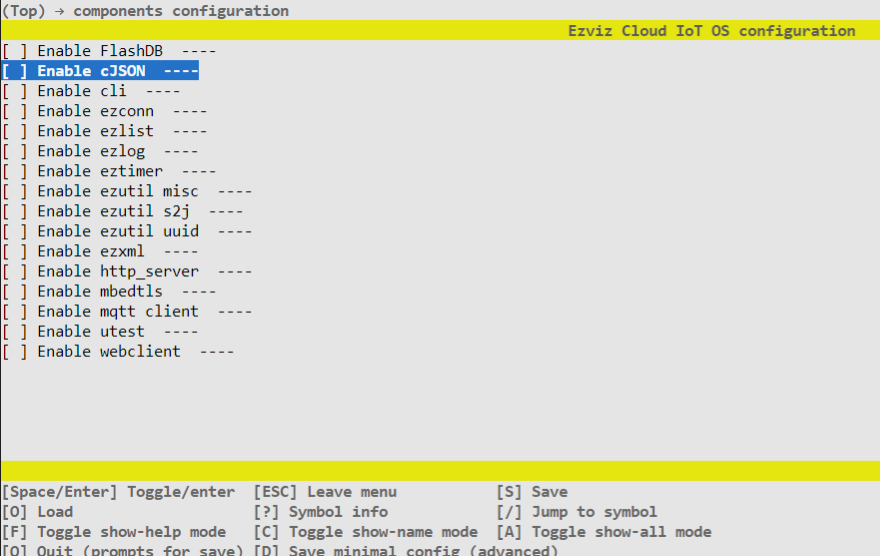

# 组件开发指南

​		Ezviz IoT OS主要由组件、构建系统和辅助工具所组成，组件是源代码的存在形态，是模块化的基本单元。组件可以是相对独立工具库，如Json库、加密库等，也可以是业务模块，如萤石云业务相关的业务，其特点是功能独立，和其他模块耦合度低，利于维护和裁剪。

## 适用范围

​        本文档将详细介绍组件的构成、规范及组件开发流程，帮助组件开发人员进行组件开发。相关规范可以参考： [目录规范 &代码规范](./docs/ezos_contribute_guide.md)

## 目录结构

```shell
ez-iot-os
|
+-- components                  // 基础组件
|   +-- component1
|   +-- component2
|   +-- component3
|
+-- eziot                       // 业务组件
|   +-- component4
|   +-- component5
|   +-- component6
|
```

**基础组件**：基础工具及开放协议相关，如Json库、加密库、网络工具、本地通讯协议（串口/wifi/蓝牙）等。

**业务组件**：萤石云端开放能力相关，如绑定、物模型、OTA、云存储等。


## 组件模板

​        基础组件和业务组件，两者在开放流程和方法上是一致的，以方法适用于两者。

### 目录模板

```
+-- component_template
    +-- inc               // 用户接口头文件
    +-- inc_private       // 内部接口头文件，仅组件内部可见
    +-- src               // 源码实现
    +-- CMakeLists.txt    // 构建脚本
    +-- Kconfig           // 配置脚本
    +-- README.md         // 组件文档
```


### 配置脚本（Kconfig）

```
menuconfig EZIOT_COMPONENT_COMPONENT_TEMPLATE_ENABLE
    bool "Enable component_template"
    default y
```


**必选**：每个组件必须包含使能配置项，命名规则：EZIOT_COMPONENT_ + 大写组件名 + _ENABLE。

**可选**：其他配置项需要根据组件开发者梳理。建议将资源相关的尽量抽到配置项中，如任务栈大小，全局变量数组大小等。和业务逻辑相关的，如重试次数，重试时间、消息可靠性等等都也可以抽取到Kconfig。


### 构建脚本（CMakeList.txt）

```cmake
if(CONFIG_EZIOT_COMPONENT_COMPONENT_TEMPLATE_ENABLE)

    ################# Add include #################
    list(APPEND ADD_INCLUDE "inc")
    list(APPEND ADD_PRIVATE_INCLUDE "inc_private")
    ###############################################

    ############## Add source files ###############
    # list(APPEND ADD_SRCS  "src/lib1.c")
    # aux_source_directory(src ADD_SRCS)  # collect all source file in src dir, will set var ADD_SRCS
    append_srcs_dir(ADD_SRCS "src")     # append source file in src dir to var ADD_SRCS
    # list(REMOVE_ITEM COMPONENT_SRCS "src/test.c")
    ###############################################

    ###### Add required/dependent components ######
    # list(APPEND ADD_REQUIREMENTS component1)
    ###############################################

    ############ Add static libs ##################
    # if(CONFIG_COMPONENT1_INCLUDE_STATIC_LIB)
    #     list(APPEND ADD_STATIC_LIB "lib/libtest.a")
    # endif()
    ###############################################

    #### Add compile option for this component ####
    #### Just for this component, won't affect other 
    #### modules, including component that depend 
    #### on this component
    # list(APPEND ADD_DEFINITIONS_PRIVATE -DAAAAA=1)

    #### Add compile option for this component
    #### and components denpend on this component
    # list(APPEND ADD_DEFINITIONS -DAAAAA222=1 -DAAAAA333=1)
    ###############################################

    # register component, DYNAMIC or SHARED flags will make component compiled to dynamic(shared) lib
    register_component()

endif()
```


脚本语法主要包含：

- if(xxxx) endif()：依赖于某个配置项，当配置项发生改动时，构建方法可随之改变。
- APPEND ADD_INCLUDE：对外导出头文件目录
- APPEND ADD_PRIVATE_INCLUDE：组件内部头文件目录
- APPEND ADD_REQUIREMENTS：依赖的其他组件
- APPEND ADD_STATIC_LIB：依赖的预编译库文件
- APPEND ADD_DEFINITIONS_PRIVATE：添加组件内部宏定义
- APPEND ADD_DEFINITIONS：添加全局宏定义
- register_component：注册成为一个组件

## 示例

​        以下通过两个示例，分别演示简单和复杂的组件如何移植/开发。

### cJSON 组件

​        cJSON是一个开源的工具类库，只有一个简单的头文件和源文件，只需要简单的按照组件模板套进去就行了

#### 目录

```
+-- cJSON
    +-- inc
    |   +-- cJSON.h
    |
    +-- inc_private
    +-- src
    |   +-- cJSON.c
    |
    +-- CMakeLists.txt
    +-- Kconfig
    +-- README.md
```

#### 配置脚本

```
menuconfig EZIOT_COMPONENT_CJSON_ENABLE
    bool "Enable cJSON"
    default y
```

#### 构建脚本

```cmake
if(CONFIG_EZIOT_COMPONENT_CJSON_ENABLE)

    ################# Add include #################
    list(APPEND ADD_INCLUDE "inc")
    list(APPEND ADD_PRIVATE_INCLUDE "inc_private")
    ###############################################

    ############## Add source files ###############
    append_srcs_dir(ADD_SRCS "src")     # append source file in src dir to var ADD_SRCS
    ###############################################

    ###### Add required/dependent components ######
    # list(APPEND ADD_REQUIREMENTS component1)
    ###############################################

    ############ Add static libs ##################
    # if(CONFIG_COMPONENT1_INCLUDE_STATIC_LIB)
    #     list(APPEND ADD_STATIC_LIB "lib/libtest.a")
    # endif()
    ###############################################

    #### Add compile option for this component ####
    #### Just for this component, won't affect other 
    #### modules, including component that depend 
    #### on this component
    # list(APPEND ADD_DEFINITIONS_PRIVATE -DAAAAA=1)

    #### Add compile option for this component
    #### and components denpend on this component
    # list(APPEND ADD_DEFINITIONS -DAAAAA222=1 -DAAAAA333=1)
    ###############################################

    # register component, DYNAMIC or SHARED flags will make component compiled to dynamic(shared) lib
    register_component()

endif()
```

### ezlog 组件

​        ezlog是在开源代码easylogger基础上开发的组件。因easylogger具有占用资源少，易移植，配置灵活等特点，更适合用于IoT产品。同时考虑到编码风格、对内部代码的兼容性等原因，又不希望直接easylogger接口，所以对其进行了简单封装。

#### 目录

```
+-- ezlog
    +-- inc
    |   +-- ezlog.h
    |
    +-- inc_private
    |   +-- elog_cfg.h
    |   +-- elog.h
    |
    +-- src
    |   +-- elog_async.c
    |   +-- elog_buf.c
    |   +-- elog_port.c         // 适配接口，切换成ezos接口
    |   +-- elog_utils.c
    |   +-- elog.c
    |   +-- ezlog.c
    |
    +-- CMakeLists.txt
    +-- Kconfig
    +-- README.md
```

#### 源码改动

- elog_port.c 主要是和平台相关的接口，需要切换成ezos对应接口。
- elog_cfg.h 是内部配置项，需要修改对应上ezos kconfig配置项，如：

```c
#ifdef CONFIG_EZIOT_COMPONENT_EZLOG_OUTPUT_ENABLE
/* enable log output. */
#define ELOG_OUTPUT_ENABLE
#endif
```


#### 配置脚本

```
menuconfig EZIOT_COMPONENT_EZLOG_ENABLE
    bool "Enable ezlog"
    default y

config EZIOT_COMPONENT_EZLOG_OUTPUT_ENABLE
    bool "Enable log output"
    default y
    depends on EZIOT_COMPONENT_EZLOG_ENABLE

config EZIOT_COMPONENT_EZLOG_ASSERT_ENABLE
    bool "Enable assert check"
    default n
    depends on EZIOT_COMPONENT_EZLOG_ENABLE

config EZIOT_COMPONENT_EZLOG_LINE_BUF_SIZE
    int "Buffer size for every line's log"
    range 512 16384
    default 1024
    depends on EZIOT_COMPONENT_EZLOG_ENABLE

config EZIOT_COMPONENT_EZLOG_LINE_NUM_MAX_LEN
    int "Output line number max length"
    default 5
    depends on EZIOT_COMPONENT_EZLOG_ENABLE

config EZIOT_COMPONENT_EZLOG_FILTER_TAG_MAX_LEN
    int "Output filter's tag max length"
    default 16
    depends on EZIOT_COMPONENT_EZLOG_ENABLE

config EZIOT_COMPONENT_EZLOG_FILTER_KW_MAX_LEN
    int "Output filter's keyword max length"
    default 16
    depends on EZIOT_COMPONENT_EZLOG_ENABLE

config EZIOT_COMPONENT_EZLOG_FILTER_TAG_LVL_MAX_NUM
    int "Output filter's tag level max num"
    range 0 5
    default 5
    depends on EZIOT_COMPONENT_EZLOG_ENABLE

choice EZIOT_COMPONENT_EZLOG_NEWLINE_SIGN
    prompt "Output newline sign"
    default EZIOT_COMPONENT_EZLOG_NEWLINE_SIGN_CRLF
    depends on EZIOT_COMPONENT_EZLOG_ENABLE

    help
        This option allows configuring the desired line endings in print data
        when a newline ('\n', LF) appears on stdout.
        Three options are possible:

        CRLF: '\r\n', whenever LF is encountered, prepend it with CR

        LF: '\n', no modification is applied, stdout is sent as is

        CR: '\r', each occurence of LF is replaced with CR

config EZIOT_COMPONENT_EZLOG_NEWLINE_SIGN_CRLF
    bool "CRLF"
config EZIOT_COMPONENT_EZLOG_NEWLINE_SIGN_LF
    bool "LF"
config EZIOT_COMPONENT_EZLOG_NEWLINE_SIGN_CR
    bool "CR"
endchoice

config EZIOT_COMPONENT_EZLOG_COLOR_ENABLE
    bool "Enable log color"
    default y
    depends on EZIOT_COMPONENT_EZLOG_ENABLE

config EZIOT_COMPONENT_EZLOG_ASYNC_OUTPUT_ENABLE
    bool "Enable asynchronous output mode"
    default n
    depends on EZIOT_COMPONENT_EZLOG_ENABLE

config EZIOT_COMPONENT_EZLOG_ASYNC_LINE_OUTPUT
    bool "Each asynchronous output's log which must end with newline sign"
    default y
    depends on EZIOT_COMPONENT_EZLOG_ENABLE && EZIOT_COMPONENT_EZLOG_ASYNC_OUTPUT_ENABLE

config EZIOT_COMPONENT_EZLOG_ASYNC_OUTPUT_USING_PTHREAD
    bool "Asynchronous output mode using POSIX pthread implementation"
    default y
    depends on EZIOT_COMPONENT_EZLOG_ENABLE && EZIOT_COMPONENT_EZLOG_ASYNC_OUTPUT_ENABLE

config EZIOT_COMPONENT_EZLOG_BUF_OUTPUT_ENABLE
    bool "Enable buffered output mode"
    default n
    depends on EZIOT_COMPONENT_EZLOG_ENABLE
```


- 编写一份对应easylogger原有的配置项(elog_cfg.h)的Kconfig，使得原有可配置功能得以全量保留。


#### 构建脚本

​        构建脚本基本遵循模板，无需大的改动。

```cmake
if(CONFIG_EZIOT_COMPONENT_EZLOG_ENABLE)

    ################# Add include #################
    list(APPEND ADD_INCLUDE "inc"
        )
    list(APPEND ADD_PRIVATE_INCLUDE "inc_private")
    ###############################################

    ############## Add source files ###############
    append_srcs_dir(ADD_SRCS "src")     # append source file in src dir to var ADD_SRCS
    ###############################################

    ###### Add required/dependent components ######
    list(APPEND ADD_REQUIREMENTS ezos)
    ###############################################

    ############ Add static libs ##################
    # if(CONFIG_COMPONENT1_INCLUDE_STATIC_LIB)
    #     list(APPEND ADD_STATIC_LIB "lib/libtest.a")
    # endif()
    ###############################################

    #### Add compile option for this component ####
    #### Just for this component, won't affect other 
    #### modules, including component that depend 
    #### on this component
    # list(APPEND ADD_DEFINITIONS_PRIVATE -DAAAAA=1)

    #### Add compile option for this component
    #### and components denpend on this component
    # list(APPEND ADD_DEFINITIONS -DAAAAA222=1 -DAAAAA333=1)
    ###############################################

    ############ Add static libs ##################
    #### Update parent's variables like CMAKE_C_LINK_FLAGS
    # set(CMAKE_C_LINK_FLAGS "${CMAKE_C_LINK_FLAGS} -Wl,--start-group libmaix/libtest.a -ltest2 -Wl,--end-group" PARENT_SCOPE)
    ###############################################

    # register component, DYNAMIC or SHARED flags will make component compiled to dynamic(shared) lib
    register_component()

endif()
```


## 组件测试

### 构建测试

**使能cJSON组件**


**找到组件和配置**

```
-- Find component: /home/xurongjun/git/ez_iot_os/components/cJSON
-- Find component Kconfig of cJSON
```


**注册组件**

```
-- [register component: cJSON ], path:/home/xurongjun/git/ez_iot_os/components/cJSON
-- component cJSON will compiled to static lib
-- component cJSON dependencies:
```


**编译组件**

```
Scanning dependencies of target cJSON
[  1%] Building C object cJSON/CMakeFiles/cJSON.dir/src/cJSON.c.o
[  3%] Linking C static library libcJSON.a
[  3%] Built target cJSON
```


**未使能cJSON组件**



**找到组件和配置**

```
-- Find component: /home/xurongjun/git/ez_iot_os/components/cJSON
-- Find component Kconfig of cJSON
```


**组件未使能，无需注册**

```
-- component cJSON not enabled
```


**编译组件**

在编译输出日志里，找不到相关源文件的编译


### 配置项测试

​        如果组件有相关配置项，应逐一进行配置，检查配置项是否能根据设计去展示和输出，检查"ezos_gconfig.h"里面的宏定义，是否能根据Kconfig的配置达到预期效果。

### 单元测试

​        组件开发完成后，建议编写对应的单元测试，这里不再展开详述。

