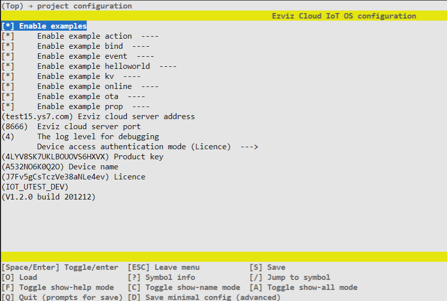

# EZOS 快速入门

本文档旨在引导用户安装 EZOS 编译构建所需的软件工具，通过一个简单的应用模板，了解如何使用EZOS菜单选项进行配置以及应用编译。

## 获取源码

下载源码：

```shell
cd ~/
git clone https://github.com/Ezviz-OpenBiz/ez_iot_os.git
```


切换源码分支（视实际情况）：

```shell
git switch V2.0.2
```

## 编译环境准备

开发环境：

- Ubuntu x64 18.04 TLS


依赖：

- CMake > V3.5.0
- Python > V2.7

### 安装CMake

检查CMake是否已安装：

```shell
cmake --version
cmake version 3.16.3
```


如果未安装，可通过在线命令安装：

```shell
sudo apt-get install cmake
```

### 安装Python

检查Python是否已安装：
```shell
python --version
Python 3.6.9
```


如果未安装，可通过在线命令安装，以Ubuntu为例：

```shell
sudo apt-get install python
```

## esp8266 开发板

### 前置

[安装esp8266 IDF](../platform/bsp/esp8266/README.md)

### 配置

```shell
cd ~/ez_iot_os/apps/ezapp_template/port/esp8266
mkdir libs && cd libs
cmake ..
make menuconfig
```


配置GUI：


配置项：

- toolchain configuration：工具链、编译参数、链接参数配置
- ez-iot configuration：业务组件使能配置、功能配置、内存内置等
- os/bsp configuration：OS/bsp层差异项配置
- components configuration：基础组件使能配置、功能配置、内存内置等
- project configuration：应用程序配置


修改后按键s保存，自动新增config目录

```shell
~/ez_iot_os/apps/ezapp_template/port/esp8266
                                     +-- config                 //配置项
                                         +-- .config            //Kconfig配置引用
                                         +-- ezos_gconfig.mk    //Makefile构建引用 
                                         +-- ezos_gconfig.h     //源代码引用
                                         +-- ezos_gconfig.cmake //CMake构建引用
```


### 编译

```shell
cd ~/ez_iot_os/apps/ezapp_template/port/esp8266
make
```


编译成功：

```shell
AR build/libsodium/liblibsodium.a
LD build/ezapp_bulb.elf
esptool.py v2.4.0
To flash all build output, run 'make flash' or:
python /opt/esp_sdk/ESP8266_RTOS_SDK/components/esptool_py/esptool/esptool.py --chip esp8266 --port /dev/ttyUSB0 --baud 115200 --before default_reset --after hard_reset write_flash -z --flash_mode dio --flash_freq 80m --flash_size 2MB 0xd000 /home/ez_iot_os/apps/ezapp_template/port/esp8266/build/ota_data_initial.bin 0x0 /home/ez_iot_os/apps/ezapp_template/port/esp8266/build/bootloader/bootloader.bin 0x14000 /home/ez_iot_os/apps/ezapp_template/port/esp8266/build/ezapp_bulb.bin 0x8000 /home/ez_iot_os/apps/ezapp_template/port/esp8266/build/partitions.bin
```

## Linux

### 示例

#### 配置
```shell
cd ~/ez_iot_os/examples
mkdir build && cd build
cmake ..
make menuconfig
```


配置GUI：


配置项：

- Enable examples：示例的使能开关
- Ezviz cloud server address：设备上线服务器域名
- Ezviz cloud server port：设备上线服务器端口
- The log level for debugging：日志等级
- Device access authentication mode
  - SAP：海康设备认证信息
  - Licence：开放业务设备认证信息

#### 编译

```shell
make
```


编译成功：

```shell
[ 91%] Building C object main/CMakeFiles/main.dir/main.c.o
[ 92%] Linking C static library libmain.a
[ 92%] Built target main
Scanning dependencies of target ezapp_example
[ 93%] Building C object CMakeFiles/ezapp_example.dir/exe_src.c.o
[ 93%] Linking C executable ezapp_example
[ 93%] Built target ezapp_example
```

#### 运行

```shell
./ezapp_example
```


输入help可以看到支持的命令行，输入对应的命令行可以得到相应的运行结果：

```
====User Commands====
example_action           : action test
example_bind             : eziot example bind param : <token> e.g example_bind cf08393f8581407fad8c3d55dae434ff
example_bind_sta         : eziot example bind status query
example_event            : eziot example event
example_helloworld       : helloworld test
example_kv               : kv test
example_online           : online test
example_ota              : ota test
example_prop             : prop test
example_prop_chg         : prop change test
```


### 应用模板

#### 配置

同esp8266一致，此处略

#### 编译

```shell
cd ~/ez_iot_os/apps/ezapp_template/port/linux
mkdir build && cd build
cmake ..
make
```


编译成功：

```shell
[ 97%] Building C object main/CMakeFiles/main.dir/home/ez_iot_os/apps/ezapp_template/product/device_info.c.o
[ 98%] Linking C static library libmain.a
[ 98%] Built target main
Scanning dependencies of target ezapp
[ 99%] Building C object CMakeFiles/ezapp.dir/exe_src.c.o
[ 99%] Linking C executable ezapp
[ 99%] Built target ezapp
```

#### 运行

应用模板上线依赖于license，需要把从license.bin放到以下目录：

```
~/ez_iot_os/apps/ezapp_template/port/linux/build
```


运行：

```
./ezapp
```