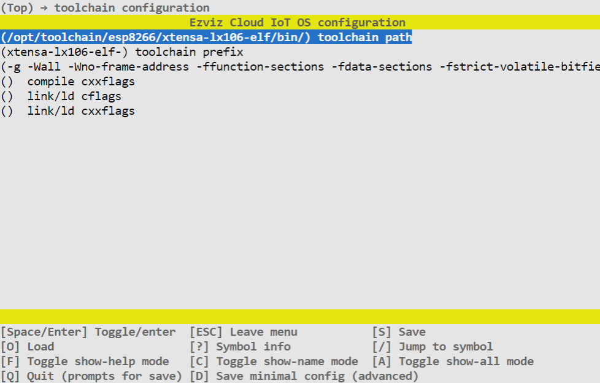

# 移植指南

由于嵌入式设备的芯片接口和外设差异较大，操作系统层会有一套抽象API用于屏蔽差异性，新的的芯片接入时需要做移植。

## 适用范围

本文档以esp8266开发板为例介绍如何快速移植EZOS

## 典型目录结构

```
+-- platform              // OS、硬件适配
|   +-- inc               // 适配接口声明
|   +-- bsp
|       +-- rt-thread     // 适配睿赛德 RT-Thread
|       +-- linux         // 适配通用 Linux
```

## 环境准备

[1.安装esp8266 IDF](https://docs.espressif.com/projects/esp8266-rtos-sdk/en/latest/get-started/index.html#get-esp8266-rtos-sdk)

[2.安装xtensa工具链](https://docs.espressif.com/projects/esp8266-rtos-sdk/en/latest/get-started/linux-setup.html)


**环境验证**

编译IDF应用模板是否能正常编译，未能正常编译表示IDF没有正确安装。

```shell
cp -r $IDF_PATH/examples/get-started/project_template .
cd project_template
make memuconfig
make
```


## 开始移植

### 新增BSP目录

在bsp下新增esp8266，建议目录名称保持和芯片型号一致。

```
+-- platform
|   +-- inc
|   +-- bsp
|       +-- config
|       +-- esp8266                   // 新增适配目录
|           +-- inc_private           // 内部头文件，组件内部可见
|           |   +-- sdkconfig.h       // 三方SDK依赖头文件，乐鑫IDF接口定义依赖此配置项
|           |
|           +-- ezos                  // EZOS接口实现，头文件参考platform->inc
|               +-- ezos_libc.c
|               +-- ezos_mem.c
|               +-- ezos_sem.c
|               +-- ezos_socket.c
|               +-- ezos_system.c
|               +-- ezos_thread.c
|               +-- ezos_time.c
|               +-- ezos_kv.c
|               +-- ezhal_wifi.c
|               +-- CMakeLists.txt    // ezos组件构建脚本
|               +-- Kconfig           // ezos组件配置项（保留，暂未使用）
|
```

### 构建脚本

构建脚本模板如下：

```cmake
################# Add include #################
list(APPEND ADD_INCLUDE "inc")
# list(APPEND ADD_PRIVATE_INCLUDE "inc_private")
###############################################

############## Add source files ###############
# list(APPEND ADD_SRCS  "src/lib1.c")
# aux_source_directory(src ADD_SRCS)  # collect all source file in src dir, will set var ADD_SRCS
append_srcs_dir(ADD_SRCS "src")     # append source file in src dir to var ADD_SRCS
# list(REMOVE_ITEM COMPONENT_SRCS "src/test.c")
###############################################

###### Add required/dependent components ######
# list(APPEND ADD_REQUIREMENTS component1)
###############################################

############ Add static libs ##################
# if(CONFIG_COMPONENT1_INCLUDE_STATIC_LIB)
#     list(APPEND ADD_STATIC_LIB "lib/libtest.a")
# endif()
###############################################

#### Add compile option for this component ####
#### Just for this component, won't affect other 
#### modules, including component that depend 
#### on this component
# list(APPEND ADD_DEFINITIONS_PRIVATE -DAAAAA=1)

#### Add compile option for this component
#### and components denpend on this component
# list(APPEND ADD_DEFINITIONS -DAAAAA222=1 -DAAAAA333=1)
###############################################

# register component, DYNAMIC or SHARED flags will make component compiled to dynamic(shared) lib
register_component()
```


脚本语法主要包含：

- APPEND ADD_INCLUDE：对外导出头文件目录
- APPEND ADD_PRIVATE_INCLUDE：组件内部头文件目录
- APPEND ADD_REQUIREMENTS：依赖的其他组件
- APPEND ADD_STATIC_LIB：依赖的预编译库文件
- APPEND ADD_DEFINITIONS_PRIVATE：添加组件内部宏定义
- APPEND ADD_DEFINITIONS：添加全局宏定义
- register_component：注册成为一个组件


**对外导出头文件目录**

```cmake
list(APPEND ADD_INCLUDE "../../../inc")
```


**组件内部头文件目录**

适配接口调用函数会依赖芯片BSP头文件，可以通过ADD_PRIVATE_INCLUDE变量引用


```cmake
if(IS_DIRECTORY ${CONFIG_EZIOT_OS_BSP_ROOT})
    # 使用Kconfig配置路径方式获取BSP根目录
    set(OS_BSP_ROOT ${CONFIG_EZIOT_OS_BSP_ROOT})
else()
    # 使用相对路径、绝对路径或者环境变量方式获取BSP根目录
    set(OS_BSP_ROOT $ENV{IDF_PATH})
endif()

if(IS_DIRECTORY ${OS_BSP_ROOT})
    list(APPEND ADD_PRIVATE_INCLUDE
        ../inc_private
        ${OS_BSP_ROOT}/components/freertos/include 
        ${OS_BSP_ROOT}/components/freertos/include/freertos 
        ${OS_BSP_ROOT}/components/freertos/include/freertos/private 
        ${OS_BSP_ROOT}/components/freertos/port/esp8266/include 
        ${OS_BSP_ROOT}/components/freertos/port/esp8266/include/freertos 
        ${OS_BSP_ROOT}/components/esp8266/include 
        ${OS_BSP_ROOT}/components/heap/include 
        ${OS_BSP_ROOT}/components/heap/port/esp8266/include 
        ${OS_BSP_ROOT}/components/nvs_flash/test_nvs_host 
        ${OS_BSP_ROOT}/components/lwip/include/lwip
        ${OS_BSP_ROOT}/components/lwip/include/lwip/apps
        ${OS_BSP_ROOT}/components/lwip/lwip/src/include
        ${OS_BSP_ROOT}/components/lwip/lwip/src/include/posix
        ${OS_BSP_ROOT}/components/lwip/port/esp8266/include
        ${OS_BSP_ROOT}/components/lwip/port/esp8266/include/port

        ${OS_BSP_ROOT}/components/freertos/include 
        ${OS_BSP_ROOT}/components/freertos/port/esp8266/include/freertos 
        ${OS_BSP_ROOT}/components/freertos/port/esp8266/include 
        ${OS_BSP_ROOT}/components/esp8266/include 
        ${OS_BSP_ROOT}/components/heap/include 
        ${OS_BSP_ROOT}/components/heap/port/esp8266/include
        ${OS_BSP_ROOT}/components/freertos/include/freertos/private
        ${OS_BSP_ROOT}/components/http_parser/include 
        ${OS_BSP_ROOT}/components/cjson/cJSON
        ${OS_BSP_ROOT}/components/lwip/lwip/src/include
        ${OS_BSP_ROOT}/components/lwip/port/esp8266/include 
        ${OS_BSP_ROOT}/components/lwip/include/lwip/apps 
        ${OS_BSP_ROOT}/components/tcpip_adapter/include
        ${OS_BSP_ROOT}/components/log/include

        ${OS_BSP_ROOT}/components/app_update/include
        ${OS_BSP_ROOT}/components/nvs_flash/include
        ${OS_BSP_ROOT}/components/spi_flash/include
        ${OS_BSP_ROOT}/components/vfs/include
    )
endif()
```


**依赖的其他组件**

无（ezos接口为底层 模块，不建议反向依赖上层组件）


**依赖的预编译库文件**

无


**添加全局宏定义**

```cmake
# IDF内部源码依赖的宏定义
list(APPEND ADD_DEFINITIONS -D_POSIX_TIMERS -D_POSIX_MONOTONIC_CLOCK)
list(APPEND ADD_DEFINITIONS  "-D__ESP_FILE__=__FILE__")
```


### 适配OS接口

OS接口会被上层组件以及应用所调用，建议接口全量实现。

<!--如果你比较确定某些接口不会被你的组件或应用所调用到，可以不实现-->

- platform->bsp->linux是基于标准libc和posix接口所适配，如果芯片支持标准posix接口，只要把对应的文件拷贝过来即可。
- 如果芯片不支持或者仅部分支持posix接口，可以从其他已bsp里拷贝一份比较接近实现（如相同操作系统），可以减少改动量。
- 部分头文件，可能因为官方BSP版本不一样或者系统差异性，编译包含目录有差异性，需要根据构建时候提示的错误做相应调整。

<!--适配细节暂不展开-->


### 适配HAL接口

HAL（Hardware Abstract Layer）即硬件抽象层，在bsp->inc中以"ezhal_"为前缀的头文件均为硬件抽象接口。因此类接口和硬件外设关系较大，适配时应考虑实际业务需要决定是否需要实现，如wifi类设备需要实现ezhal_wifi.h声明的接口，但无需实现ezhal_ble.h蓝牙类的接口。


<!--适配细节暂不展开-->

### 编译配置

ezos使用的是gcc编译工具，需要芯片厂商提供对应的工具链。ezos将工具链的相关配置也放在了Kconfig配置文件中，用户可根据项目的需要动态修改编译链接参数。



相关配置项主要包括：

- 工具链路径：即gcc工具链的全路径，可根据工具链安装情况进行调整。
- 工具链名字：工具链前缀，构建系统会自动补全gcc或g++后缀
- gcc编译参数：可通过芯片资料或芯片厂商FAE处获得，如调用do_lib_building接口进行构建，**应确保此参数和上层应用一致，否则在链接或实际运行中可能会遇到未知问题**。
- g++编译参数：C++编译参数，注意事项同上
- gcc链接参数：调用do_lib_building接口构建不需要填写，调用do_project_building接口构建需根据实际情况填写。
- g++链接参数：C++链接参数，注意事项同上

### 验证

以上移植工作完成，仅代表完成了编码阶段的工作。**评估移植工作是否成功，应以产品验证为准**，即产品通过了系统测试验收，并完成固件发布。正常来说会经历以下几个阶段：编译->链接->接口自测->集成测试->系统测试->固件发布。

#### 通过应用验证

这是比较理想的情况，已经有成熟的固件，移植是为了在新的芯片上实现一样的应用功能，可根据原来的功能逐个进行回归验证移植的质量。

#### 单元测试验证

在没有成熟应用的情况下，可通过单元测试解决，可保障前三个阶段的质量，提前收敛移植缺陷。使用ez_iot_os\unit_test\case\ut_ezos.c 单元测试用例，对测试移植接口进行逐个验收。